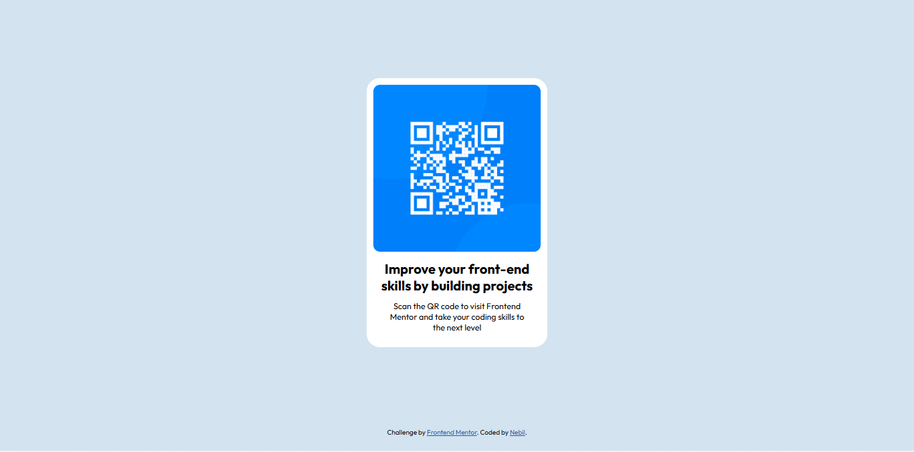

# Frontend Mentor - QR code component solution

This is my solution to the [QR code component challenge on Frontend Mentor](https://www.frontendmentor.io/challenges/qr-code-component-iux_sIO_H). Frontend Mentor challenges help you improve your coding skills by building realistic projects. 

## Table of contents

- [Overview](#overview)
  - [Screenshot](#screenshot)
  - [Links](#links)
- [My process](#my-process)
  - [Built with](#built-with)
  - [What I learned](#what-i-learned)
  - [Continued development](#continued-development)
- [Author](#author)

## Overview

### Screenshot

### Links

- Solution URL: [https://github.com/nebil-devs/qr-code-component]

## My process

### Built with

- Semantic HTML5 markup
- CSS3

### What I learned

I learned the usage of semantic HTML and also basic responsive CSS styling during this project. 

### Continued development

For future projects, I want to focus on more difficult challenges and also increase my ability to use HTML and CSS in an efficient manner.

## Author

- Frontend Mentor - [@nebil-devs](https://www.frontendmentor.io/profile/nebil-devs)
- Github - [@nebil-devs](https://github.com/nebil-devs)

